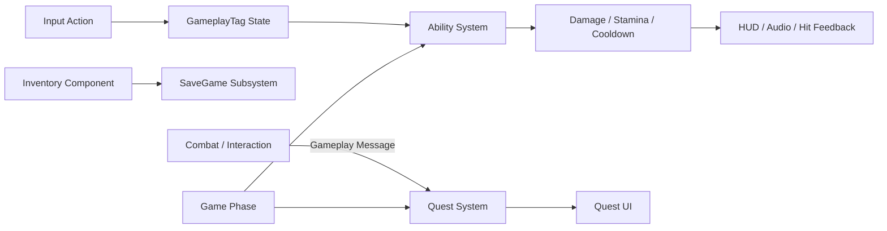

# ProjectAE — Alien Escape

> Unreal Engine 5로 제작한 3인 팀 TPS 익스트랙션 슈터입니다. 이 저장소에서는 제가 담당한 GAS 기반 전투, 인벤토리·저장, 퀘스트, 게임 페이즈 등 C++ 코어 시스템을 중심으로 확인할 수 있습니다.

[](https://youtu.be/xRlHbQEcFOc)

> [!WARNING]
> **이 저장소는 포트폴리오와 코드 리뷰를 위한 소스 아카이브입니다.** 제작에 사용한 상용 에셋과 이에 의존하는 일부 Content, Blueprint, Map 데이터는 배포하지 않습니다. 따라서 이 저장소만으로 전체 게임을 빌드하거나 실행할 수 없습니다. 완성된 플레이 결과는 위 영상에서, 구현 내용은 아래 코드 탐색 경로에서 확인해 주세요.

| 항목 | 내용 |
|---|---|
| 프로젝트 | Alien Escape |
| 장르 | TPS Extraction Shooter |
| 기간 | 2025.11.03 – 2025.12.24, 약 50일 |
| 팀 | 3명 |
| 플랫폼 | Windows |
| 개발 당시 엔진 | Unreal Engine 5.4.4 |
| 사후 분석 환경 | Unreal Engine 5.8 |
| 저장소 성격 | Code Archive / Not Standalone Buildable |
| 상세 포트폴리오 | [Notion](https://app.notion.com/p/39cf36bcd9d981cd8fb1fc3ae4812360) |

## 목차

- [Repository Scope](#repository-scope)
- [프로젝트와 담당 범위](#프로젝트와-담당-범위)
- [시스템 연결](#시스템-연결)
- [핵심 구현](#핵심-구현)
- [Post-project Technical Investigation](#post-project-technical-investigation)
- [코드 탐색 가이드](#코드-탐색-가이드)
- [게임 조작법](#게임-조작법)
- [저장소 구조](#저장소-구조)
- [제약과 알려진 한계](#제약과-알려진-한계)
- [문서와 링크](#문서와-링크)
- [TeamAE](#teamae)

## Repository Scope

### 포함된 내용

- ProjectAE C++ 런타임 소스
- GAS, 인벤토리, 저장, 퀘스트, UI 연결 코드
- 프로젝트 설정과 모듈 의존성
- 일부 프로젝트 제작 Content와 플러그인 코드
- 포트폴리오용 사후 Grass Map 분석 코드와 문서

### 포함하지 않는 내용

- 프로젝트 제작에 사용한 전체 상용 에셋
- 상용 에셋에 의존하는 일부 Blueprint, Material, Map, Animation 데이터
- 완전한 패키징·실행 환경
- 제3자가 동일 결과를 재현할 수 있는 배포 빌드

따라서 이 README는 실행 설명서가 아니라 **결과 영상에서 확인한 기능을 C++ 소스에서 찾기 위한 안내서**입니다.

### 권장 탐색 순서

1. [플레이 영상](https://youtu.be/xRlHbQEcFOc)으로 프로젝트 결과를 확인합니다.
2. 아래 담당 범위와 시스템 연결을 확인합니다.
3. 관심 있는 기능의 시작 파일을 코드 탐색 표에서 엽니다.
4. 더 깊은 설계 배경은 상세 문서와 [Notion 포트폴리오](https://app.notion.com/p/39cf36bcd9d981cd8fb1fc3ae4812360)를 확인합니다.

## 프로젝트와 담당 범위

저는 코어 게임플레이 시스템과 GAS 기반 C++ 로직을 담당했습니다.

| 영역 | 담당 내용 |
|---|---|
| GAS | 입력 태그, 스태미나, 쿨다운, 상태 처리 |
| Combat | Damage Execution, Projectile, Hit Feedback |
| Inventory | 슬롯 관리, UI 연결, 저장 캐시 |
| Quest | Event-Driven Objective, UI 갱신, 월드 이벤트 |
| Core Flow | GamePhase, RaidSession, SaveGame 연동 |

이 프로젝트의 중요한 경험은 기능을 개별적으로 만드는 데서 끝나지 않고, 서로 다른 수명주기와 상태를 가진 시스템을 하나의 플레이 흐름 안에서 연결한 것입니다.

## 시스템 연결



## 핵심 구현

### GAS 입력과 상태

`UAEAbilitySystemComponent`는 Input Action을 개별 Ability에 직접 묶지 않고 GameplayTag를 중간 계층으로 사용합니다. 입력이 눌리고 떼어진 상태를 Loose Tag로 표현하고, Ability와 UI가 동일한 태그 상태를 읽도록 구성했습니다.

- 입력 태그 Press / Release
- Stamina 기반 Ability 실행 조건
- GameplayEffect의 Cooldown Tag 조회
- Attribute Set과 Damage Execution
- UI 상태 표시와 Hit Feedback 연결

### 전투와 피드백

전투 결과가 계산에서 끝나지 않고 플레이어에게 전달되도록 다음 흐름을 연결했습니다.

```text
Input → Ability → Projectile / Interaction → Damage Execution
      → Attribute Change → HUD / Audio / Hit Feedback
```

이 프로젝트를 통해 전투 시스템의 기반 구조와 실제 액션의 손맛은 서로 다른 문제라는 점을 배웠습니다. 상태 흐름은 구성했지만 애니메이션, VFX, 타이밍의 세부 완성도를 충분히 높이지 못한 점은 한계로 남았습니다.

### 인벤토리와 저장 캐시

플레이어 인벤토리는 `SaveGameSubsystem`의 GameInstance 수명 캐시와 연결됩니다. `FDataTableRowHandle` 기반 슬롯의 RowName, Amount, DataTable 참조를 직렬화해 레벨 전환 사이에서 상태를 유지합니다.

### GameplayMessage 기반 퀘스트

Deliver와 Extract Objective는 `GameplayMessageSubsystem`을 구독하고 Target Tag를 검사해 진행도를 갱신합니다. 전투나 상호작용 코드는 퀘스트 객체를 직접 참조하지 않고 사건을 방송합니다.

이 구현에서 느낀 데이터 작성, 책임 분리, 복제 구조의 한계가 이후 [QuestSysDemo](https://github.com/furu23/QuestSysDemo)를 다시 설계하는 출발점이 됐습니다.

## Post-project Technical Investigation

> [!NOTE]
> 아래 Grass Map 분석은 팀 프로젝트 기간의 공동 결과가 아닙니다. 프로젝트 종료 후 보관 중인 환경을 UE 5.8로 옮겨 별도로 수행한 재현·분석 작업입니다.

LGame 진입 직후 Landscape Grass가 한 박자 늦게 나타나는 현상을 로그와 Unreal Insights로 추적했습니다.

- `RegenerateGrass` 반환과 실제 화면 표시 완료를 구분
- 근거리 Grass Component와 Render Instance 상태 관찰
- 상태 안정화 후 Render Fence 삽입
- Fence 완료 이후 추가 프레임을 기다린 뒤 Ready 처리
- Direct PIE와 OpenLevel 진입 경로의 GrassData 수명주기 비교
- 동일 카메라·완료 반경 4000cm 조건에서 약 15초 → 3초 측정

전체 분석은 [Grass Map Investigation](docs/grass-map-investigation.md)을 참고하세요.

## 코드 탐색 가이드

| 관심 영역 | 시작 파일 |
|---|---|
| GAS 입력과 상태 | [`AEAbilitySystemComponent.cpp`](Source/ProjectAE/Private/AbilitySystem/AEAbilitySystemComponent.cpp) |
| Damage Execution | [`AEDamageExecution.cpp`](Source/ProjectAE/Private/AbilitySystem/AEDamageExecution.cpp) |
| Attribute Set | [`AS_BaseCombat.cpp`](Source/ProjectAE/Private/AbilitySystem/AS_BaseCombat.cpp) |
| Projectile | [`ProjectileBase.cpp`](Source/ProjectAE/Private/Actor/Projectile/ProjectileBase.cpp) |
| Hit Feedback | [`HitFeedback.cpp`](Source/ProjectAE/Private/FX/Data/HitFeedback.cpp) |
| 인벤토리·직렬화 | [`InventoryComponent.cpp`](Source/ProjectAE/Private/Inventory/InventoryComponent.cpp) |
| SaveGame 캐시 | [`SaveGameSubsystem.cpp`](Source/ProjectAE/Private/Core/SaveGameSubsystem.cpp) |
| 퀘스트 서브시스템 | [`AEQuestSubSystem.cpp`](Source/ProjectAE/Private/Quest/AEQuestSubSystem.cpp) |
| Deliver Objective | [`QuestObjective_Deliver.cpp`](Source/ProjectAE/Private/Quest/QuestObjective/Deliver/QuestObjective_Deliver.cpp) |
| Game Phase | [`GamePhaseSubsystem.cpp`](Source/ProjectAE/Private/Core/GamePhaseSubsystem.cpp) |
| Grass Map 사후 분석 | [`AEGameMode.cpp`](Source/ProjectAE/Private/Core/AEGameMode.cpp) |

## 게임 조작법

> 아래 키는 완성된 프로젝트의 플레이 기준 참고 정보입니다. 이 저장소 단독 실행을 의미하지 않습니다.

| 동작 | 키 |
|---|---|
| 이동 | `W`, `A`, `S`, `D` |
| 달리기 | `Shift` |
| 구르기 | `Space` |
| 상호작용 | `F` |
| 인벤토리 | `I` |
| 퀘스트 | `P` |
| 일시정지 | `Esc` |

## 저장소 구조

```text
ProjectAE/
├─ Config/                    # 프로젝트 설정
├─ Content/                   # 일부 프로젝트 Content만 포함
├─ Plugins/                   # 프로젝트에서 사용한 플러그인
├─ Source/ProjectAE/
│  ├─ AbilitySystem/          # GAS, Attribute, Ability
│  ├─ Actor/                  # Projectile, Quest Location 등
│  ├─ Characters/             # Player, Enemy, State
│  ├─ Core/                   # GameMode, Phase, Save, Raid
│  ├─ FX/                     # Audio, Hit Feedback
│  ├─ Interaction/            # 상호작용
│  ├─ Inventory/              # 슬롯, Loot, UI
│  ├─ Quest/                  # Objective와 게임 연동
│  └─ Widgets/                # HUD와 상태 UI
└─ docs/                      # 코드 리뷰용 상세 문서
```

## 제약과 알려진 한계

- 전체 상용 에셋과 의존 Content가 없어 저장소만으로 빌드·실행할 수 없습니다.
- Blueprint와 Map의 일부 참조는 원본 Content 환경을 전제로 합니다.
- 팀 프로젝트 당시 엔진은 UE 5.4.4였으며, 현재 UE 5.8 사후 분석 환경과 구분해야 합니다.
- UI, VFX, 애니메이션 타이밍의 세부 완성도는 개선 여지가 있습니다.
- Grass Map 분석은 포트폴리오용 사후 기술 탐구이며 팀 공동 성과로 주장하지 않습니다.

## 문서와 링크

- [프로젝트 폴더 구조](PROJECT_STRUCTURE.md)
- [Quest System 연동 문서](QuestSysInfo.md)
- [Grass Map Investigation](docs/grass-map-investigation.md)
- [기존 README 보관본](docs/legacy/README_legacy.md)
- [Gameplay Video](https://youtu.be/xRlHbQEcFOc)
- [Notion Portfolio](https://app.notion.com/p/39cf36bcd9d981cd8fb1fc3ae4812360)

## TeamAE

| 팀원 | 담당 |
|---|---|
| 김재환 | PM, 인게임 게임플레이 개발 |
| 김영채 | 적 AI 개발, 레벨 디자인 |
| 박동진 | 코어 게임 시스템 개발 |
