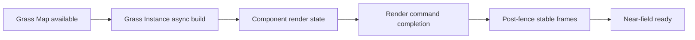

# Landscape Grass Map Startup Investigation

> 이 문서는 ProjectAE 팀 프로젝트 종료 후 UE 5.8 환경에서 별도로 수행한 포트폴리오용 기술 분석을 기록합니다. 팀 프로젝트 기간의 공동 결과와 구분합니다.

## Problem

LGame을 시작한 직후 Landscape Grass가 보이지 않고, 약간의 시간이 지난 뒤 한 번에 나타나는 현상이 있었습니다. 로딩 화면을 충분히 길게 유지해도 식생이 보이는 시점과 로딩 로직의 종료 시점을 직접 연결할 수 없었습니다.

초기 접근의 한계는 다음과 같았습니다.

- `RegenerateGrass` 함수 반환은 화면 표시 완료를 의미하지 않음
- 강제 동기화 호출만으로 Runtime Virtual Texture와 GPU 후속 프레임까지 보장할 수 없음
- 고정 Delay는 PC 환경과 진입 경로가 달라지면 완료를 보장하지 못함

## Investigation goal

식생이 실제로 보일 준비가 끝난 시점을 관찰 가능한 상태 조합으로 정의하고, 근거리 식생을 먼저 준비한 뒤 화면을 공개하는 것이 목표였습니다.

## Async stages

추적 과정에서 데이터 준비, Instance 비동기 생성, Render State, Render Command, 화면 표시를 서로 다른 단계로 분리했습니다.

## Completion policy

포트폴리오 실험에서 사용한 근거리 Ready 조건은 다음과 같습니다.

1. 카메라 위치를 기준으로 완료 반경 4000cm를 설정합니다.
2. `PrioritizeGrassCreation(true)`로 근거리 생성 예산을 우선 배정합니다.
3. 근거리 Grass Component와 Render Instance 스냅샷을 비교합니다.
4. 상태가 4프레임 유지되면 `FRenderCommandFence`를 삽입합니다.
5. Fence 완료 후 8프레임을 추가로 기다립니다.
6. Ready 처리 후 우선순위를 해제하고 원거리 생성은 기존 비동기 흐름에 맡깁니다.

고정 시간 대신 실제 근거리 렌더 데이터가 존재하고 일정 시간 변하지 않는지를 완료 조건으로 사용했습니다.

## Measurement

동일한 카메라 구성과 완료 반경 4000cm 조건에서 반복 측정했습니다.

| 조건 | 근거리 Ready 시간 |
|---|---:|
| 기존 로딩 경로 | 약 15초 |
| 근거리 우선 + 상태 관찰 | 약 3초 |

측정값은 특정 프로젝트 환경의 포트폴리오 실험 결과이며, 다른 Landscape 구성이나 하드웨어에서 동일한 성능을 보장하는 일반 벤치마크가 아닙니다.

## Entry path difference

동일한 GameMode 호출이라도 레벨 진입 경로에 따라 Grass 생성이 시작되는지가 달랐습니다.

### Direct PIE

Editor World의 Grass Map 데이터를 PIE World가 공유할 수 있어 정상적으로 생성이 시작됐습니다.

### OpenLevel

Warehouse에서 LGame으로 이동해 새 GameWorld가 만들어지는 경로에서는 직렬화된 GrassData 또는 런타임 생성 경로가 필요했습니다. 조건이 충족되지 않으면 30초 동안 Component 수가 0인 상태로 Timeout됐습니다.

엔진 소스의 Landscape Grass Map 생성 조건과 CVar 통제 실험을 교차해 **레벨 전환 경로에 따른 Grass Map 데이터 수명주기 차이**로 원인을 좁혔습니다.

## Controlled experiments

| 실험 | 관찰 |
|---|---|
| StartPlay 정상 호출 확인 | 초기화 누락 가능성 제외 |
| `grass.DensityScale = 0.4` 유지 | 밀도 설정을 원인 후보에서 제외 |
| Runtime Generation 활성화 | OpenLevel 경로에서 생성이 즉시 시작됨 |

## Code navigation

- [`AEGameMode.h`](../Source/ProjectAE/Public/Core/AEGameMode.h)
- [`AEGameMode.cpp`](../Source/ProjectAE/Private/Core/AEGameMode.cpp)
- [`ProjectAE.Build.cs`](../Source/ProjectAE/ProjectAE.Build.cs)

주요 함수:

- `RequestLandscapeGrassRVTPreload`
- `SetLandscapeGrassPriority`
- `CompleteLandscapeGrassReadiness`
- `UsesPrioritizedNearFieldPolicy`

## Limits

- 원본 Content와 Landscape 설정이 필요하므로 이 저장소만으로 실험을 재현할 수 없습니다.
- 팀 프로젝트 종료 후 추가한 분석 코드이며 당시 게임 출시 빌드의 기능이 아닙니다.
- 측정값은 특정 카메라, 맵, 하드웨어 조건의 결과입니다.
- 엔진 내부 정책에 의존하므로 Unreal Engine 버전이 바뀌면 재검증해야 합니다.

